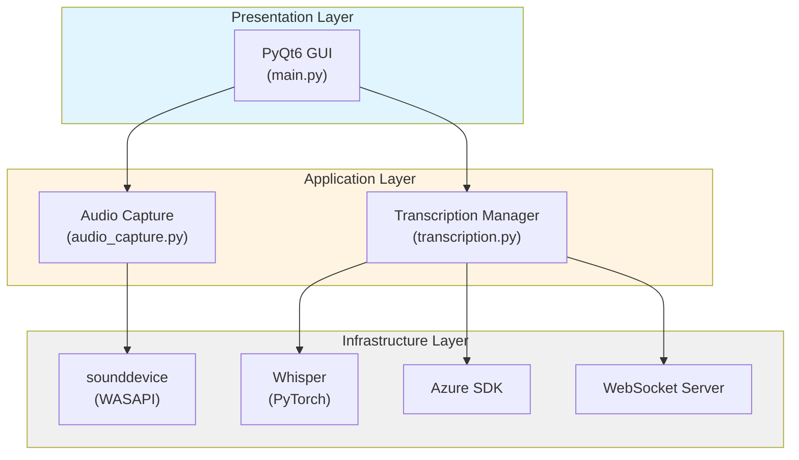
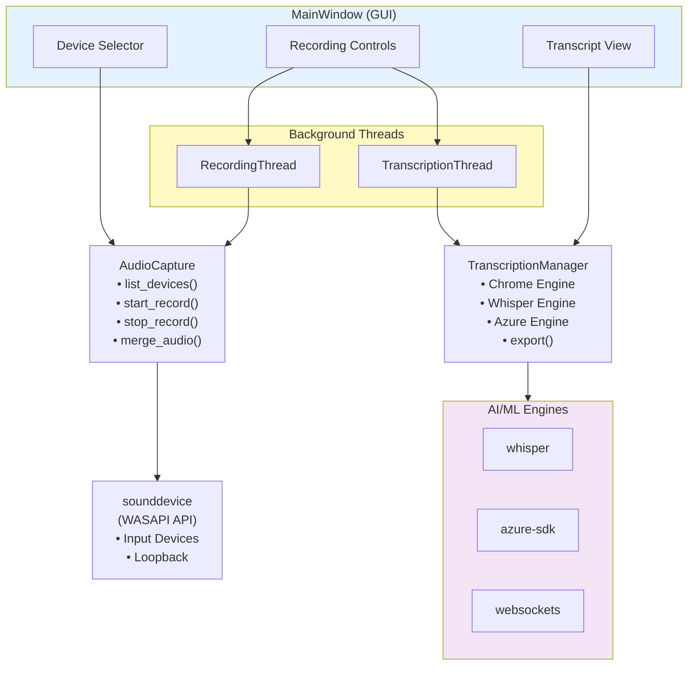
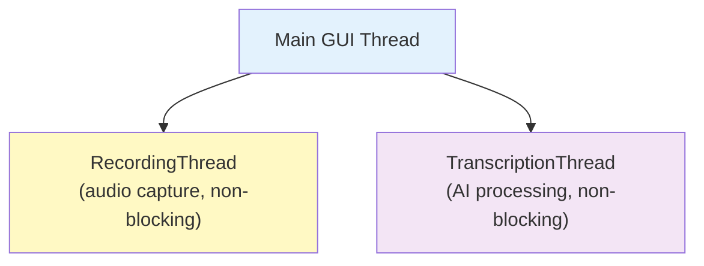
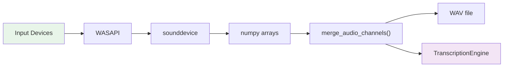
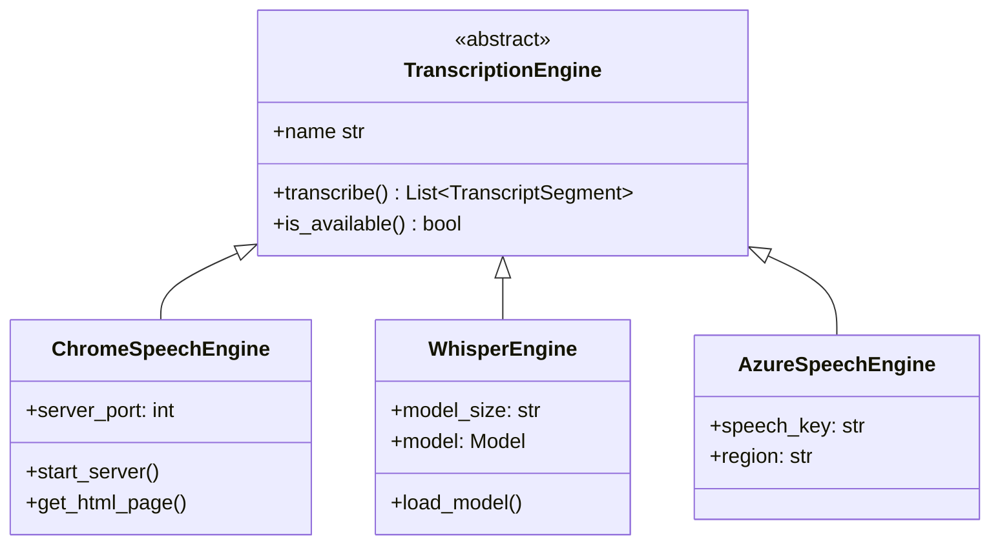
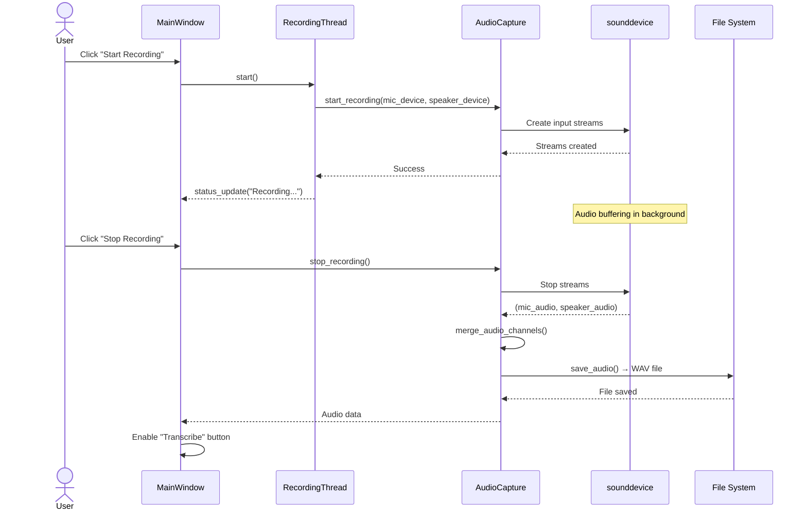
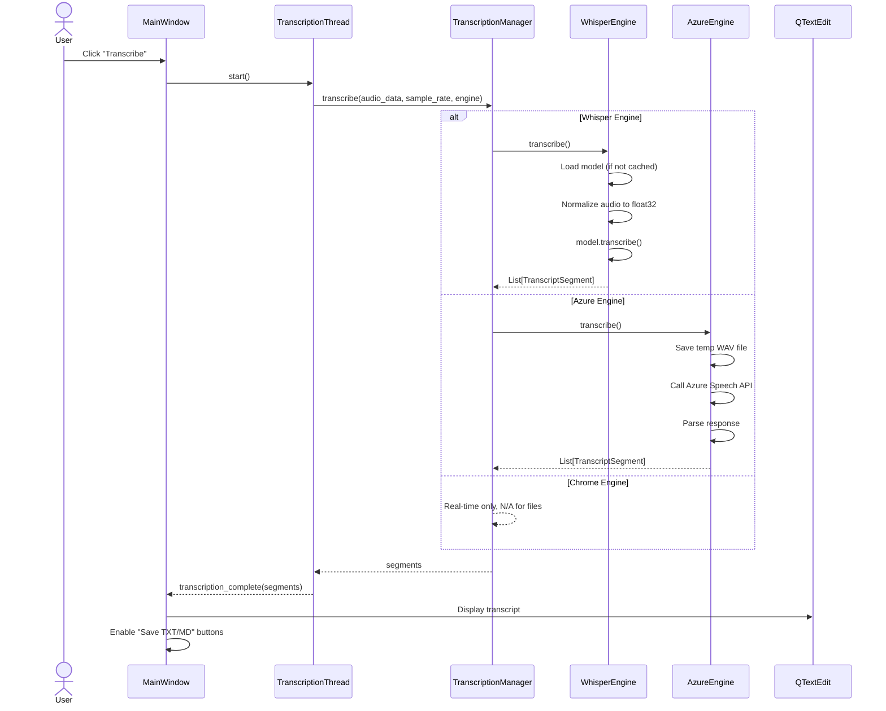
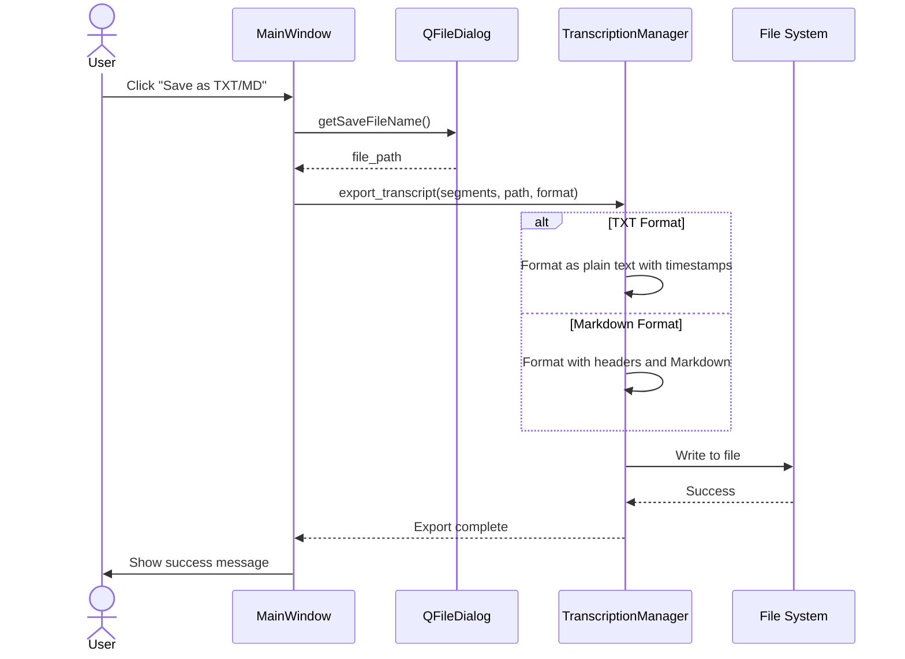

# Architecture Documentation
## Meeting Transcription & MoM Generator

### Document Version
- **Version**: 1.0
- **Last Updated**: December 3, 2025
- **Status**: Production

---

## 1. System Overview

### 1.1 Purpose
The Meeting Transcription & MoM Generator is a Windows desktop application designed to capture audio from meetings (microphone and system audio) and convert speech to text using multiple transcription engines. The application provides a simple, user-friendly interface for recording, transcribing, and exporting meeting minutes.

### 1.2 Key Capabilities
- **Dual Audio Capture**: Simultaneous microphone and system audio (loopback) recording
- **Multi-Engine Transcription**: Support for Chrome Web Speech API, OpenAI Whisper, and Azure Speech Service
- **Export Formats**: Plain text (.txt) and Markdown (.md)
- **Compliance Management**: View and delete recordings for data privacy
- **Offline Operation**: Local Whisper engine works without internet connectivity

---

## 2. Architecture Layers

### 2.1 High-Level Architecture



### 2.2 Component Diagram



---

## 3. Core Components

### 3.1 Presentation Layer

#### **MainWindow** (`main.py`)
- **Responsibility**: User interface and orchestration
- **Key Classes**:
  - `MainWindow`: Main application window (QMainWindow)
  - `RecordingThread`: Background thread for audio capture (QThread)
  - `TranscriptionThread`: Background thread for transcription (QThread)

**UI Components**:
- Audio device selection (ComboBoxes)
- Recording controls (Start/Stop/Transcribe buttons)
- Transcription engine selector
- Real-time transcript display (QTextEdit)
- Export controls (Save TXT/MD)
- Recording management (View/Delete)

**Threading Model**:


### 3.2 Application Layer

#### **AudioCapture** (`audio_capture.py`)
- **Responsibility**: Audio device management and recording
- **Key Methods**:
  - `list_devices()`: Enumerate input and loopback devices
  - `get_default_devices()`: Get system default mic/speaker
  - `start_recording()`: Begin audio capture (mic and/or system)
  - `stop_recording()`: End capture and return audio data
  - `merge_audio_channels()`: Combine mic + system audio
  - `save_audio()`: Export to WAV file

**Audio Flow**:


#### **TranscriptionManager** (`transcription.py`)
- **Responsibility**: Manage multiple transcription engines
- **Architecture Pattern**: Strategy Pattern (pluggable engines)

**Class Hierarchy**:


**Key Classes**:

1. **TranscriptSegment**: Data model for transcribed text
   - `text`: Transcribed content
   - `start_time`, `end_time`: Timestamps
   - `speaker`: Speaker identification
   - `confidence`: Recognition confidence score

2. **TranscriptionEngine (ABC)**: Interface for all engines
   - `transcribe()`: Convert audio to segments
   - `is_available()`: Check engine availability
   - `name`: Engine display name

3. **ChromeSpeechEngine**: Browser-based real-time transcription
   - WebSocket server on port 8765
   - Generates HTML page for browser
   - Real-time callback support

4. **WhisperEngine**: Local AI transcription
   - Lazy model loading
   - Supports tiny/base/small/medium/large models
   - CPU and GPU support
   - Offline operation

5. **AzureSpeechEngine**: Cloud-based enterprise transcription
   - Requires API key and region
   - High accuracy
   - Language auto-detection

#### **Configuration** (`config.py`)
- **Responsibility**: Centralized settings management
- **Configuration Sources**:
  1. Environment variables (`.env` file)
  2. Default values (fallback)

**Key Settings**:
- Project paths (recordings, transcripts, models)
- Audio parameters (sample rate, channels)
- Transcription engine selection
- Device preferences

### 3.3 Infrastructure Layer

#### **Dependencies**

| Library                        | Purpose                 | Version   |
| ------------------------------ | ----------------------- | --------- |
| PyQt6                          | Desktop GUI framework   | 6.10.0    |
| sounddevice                    | Audio I/O (WASAPI)      | 0.5.3     |
| numpy                          | Audio data processing   | Latest    |
| scipy                          | Audio filtering         | Latest    |
| openai-whisper                 | Local AI transcription  | 20250625  |
| torch                          | ML backend for Whisper  | 2.9.1+cpu |
| azure-cognitiveservices-speech | Azure Speech SDK        | 1.47.0    |
| websockets                     | Chrome Speech WebSocket | Latest    |
| python-dotenv                  | Environment config      | Latest    |

---

## 4. Data Flow

### 4.1 Recording Flow



### 4.2 Transcription Flow



### 4.3 Export Flow



---

## 5. Design Patterns

### 5.1 Strategy Pattern
**Use Case**: Transcription engines
- `TranscriptionEngine` is the strategy interface
- Concrete strategies: `ChromeSpeechEngine`, `WhisperEngine`, `AzureSpeechEngine`
- `TranscriptionManager` is the context
- Allows runtime engine switching

### 5.2 Observer Pattern
**Use Case**: Qt Signals and Slots
- Threads emit signals when operations complete
- MainWindow slots handle UI updates
- Decouples background work from UI updates

### 5.3 Singleton Pattern
**Use Case**: Configuration
- Single `config` module imported across app
- Centralized settings management

### 5.4 Thread Pool Pattern
**Use Case**: Background operations
- `RecordingThread` for non-blocking audio capture
- `TranscriptionThread` for CPU-intensive AI processing
- Prevents UI freezing

---

## 6. File System Organization

```
speech2text/
├── main.py                  # GUI application entry point
├── audio_capture.py         # Audio recording module
├── transcription.py         # Transcription engines
├── config.py                # Configuration management
├── requirements.txt         # Python dependencies
├── setup.ps1                # Windows setup script
├── .env                     # User configuration (git-ignored)
├── .env.example             # Configuration template
├── README.md                # User documentation
├── QUICKSTART.md            # Quick start guide
│
├── recordings/              # Audio files (WAV)
│   └── recording_YYYYMMDD_HHMMSS.wav
│
├── transcripts/             # Exported transcripts
│   ├── transcript_YYYYMMDD_HHMMSS.txt
│   └── transcript_YYYYMMDD_HHMMSS.md
│
├── models/                  # Whisper model cache
│   ├── tiny.pt
│   ├── base.pt
│   └── ...
│
├── tests/                   # Test scripts
│   ├── test_audio.py
│   ├── test_transcription.py
│   └── test_whisper_system.py
│
└── docs/                    # Documentation
    ├── ARCHITECTURE.md      # This file
    ├── REQUIREMENTS.md      # Requirements specification
    └── ROADMAP.md           # Feature roadmap
```

---

## 7. Security and Privacy

### 7.1 Data Storage
- All recordings stored locally (no cloud upload by default)
- User has full control over file deletion
- Compliance-friendly "Delete All Recordings" feature

### 7.2 Audio Capture
- Explicit user consent required (Start Recording button)
- Visual indicators when recording is active
- System audio capture requires Stereo Mix configuration

### 7.3 API Keys
- Azure keys stored in `.env` file (not in code)
- `.env` excluded from version control
- Optional: Azure engine only used if configured

---

## 8. Performance Considerations

### 8.1 Audio Processing
- **Sample Rate**: 16 kHz (optimal for speech recognition)
- **Bit Depth**: 16-bit (standard quality)
- **Buffer Size**: Configurable via sounddevice

### 8.2 Whisper Performance
- **Model Selection**:
  - `tiny`: ~1GB RAM, fastest (2-3x realtime)
  - `base`: ~1.5GB RAM, good balance (recommended)
  - `small`: ~2.5GB RAM, better accuracy
  - `medium`: ~5GB RAM, high accuracy
  - `large`: ~10GB RAM, best accuracy
- **CPU vs GPU**: Auto-detects CUDA, falls back to CPU
- **Model Caching**: Models loaded once, reused

### 8.3 UI Responsiveness
- Audio capture runs in `RecordingThread`
- Transcription runs in `TranscriptionThread`
- Main GUI thread never blocks
- Progress indicators for long operations

---

## 9. Error Handling

### 9.1 Audio Capture Errors
- Device not found → Show error dialog, refresh devices
- Recording failure → Display error message, log details
- Insufficient permissions → Guide user to enable access

### 9.2 Transcription Errors
- Model loading failure → Show error, suggest smaller model
- API connection failure → Display network error, retry option
- Out of memory → Suggest smaller Whisper model

### 9.3 File System Errors
- Disk full → Alert user, prevent data loss
- Permission denied → Show clear error message
- File corruption → Graceful degradation

---

## 10. Deployment

### 10.1 System Requirements
- **OS**: Windows 10/11 (64-bit)
- **Python**: 3.8+
- **RAM**: 4GB minimum, 8GB recommended
- **Disk**: 2GB for models + space for recordings
- **Audio**: Microphone and/or system audio device

### 10.2 Installation
1. Clone repository
2. Create virtual environment
3. Run `setup.ps1` or install dependencies manually
4. Configure `.env` (optional)
5. Run `python main.py`

### 10.3 Distribution Options
- **Python Source**: Requires Python installation
- **PyInstaller**: Single-file executable (future)
- **MSI Installer**: Windows native package (future)

---

## 11. Testing Strategy

### 11.1 Unit Tests
- Audio device enumeration
- Audio data merging
- Transcription engine switching
- Export formatting

### 11.2 Integration Tests
- End-to-end recording → transcription → export
- Multi-engine transcription comparison
- Device hot-plugging

### 11.3 Manual Tests
- Real meeting recording
- Various audio qualities
- Long-duration recordings (1+ hours)

---

## 12. Future Architecture Considerations

### 12.1 Scalability
- **Database**: SQLite for transcript history
- **Caching**: Redis for frequently used models
- **Cloud Sync**: Optional Azure/AWS integration

### 12.2 Microservices
- **API Server**: REST API for transcription service
- **Queue**: Background job processing
- **WebUI**: Browser-based interface option

### 12.3 Plugin System
- **Custom Engines**: Plugin API for new transcription backends
- **Export Formats**: Plugin for PDF, DOCX, etc.
- **Integrations**: Slack, Teams, Email

---

## Appendix A: Technology Justification

### Why PyQt6?
- Native Windows look and feel
- Excellent threading support
- Rich widget library
- Active development

### Why Whisper?
- State-of-the-art accuracy
- Offline operation
- Free and open source
- Multi-language support

### Why sounddevice?
- WASAPI support on Windows
- Low-latency audio capture
- Simple API
- Active maintenance

### Why Multiple Engines?
- Flexibility: Online/offline, free/paid
- Redundancy: Fallback options
- Comparison: Evaluate quality
- User Choice: Different use cases
